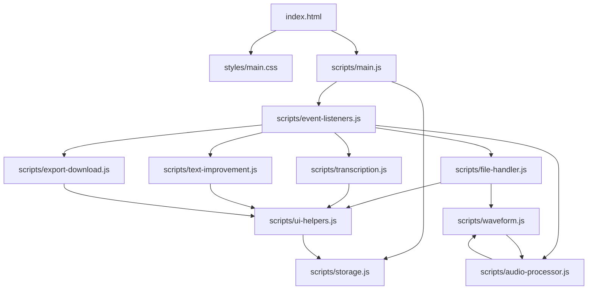

# 📂 מבנה פרויקט תמלול עברית AI

## 🎯 מטרת המסמך
מסמך זה מפרט את המבנה המלא של אפליקציית תמלול עברית AI, כולל תיאור מפורט של כל קובץ, הפונקציות שבו, והקשרים בין הרכיבים השונים.

## 📁 מבנה התיקיות
```
hebrew-transcription-ai/
├── index.html                    # הקובץ הראשי
├── PROJECT_STRUCTURE.md          # המסמך הזה
├── README.md                     # הוראות הפעלה
├── styles/
│   └── main.css                  # עיצוב ראשי
└── scripts/
    ├── storage.js                # ניהול זיכרון מקומי
    ├── audio-processor.js        # עיבוד אודיו
    ├── waveform.js              # ויזואליזציה של גלים
    ├── ui-helpers.js            # פונקציות עזר לממשק
    ├── file-handler.js          # טיפול בקבצים
    ├── transcription.js         # תמלול OpenAI
    ├── text-improvement.js      # שיפור טקסט AI
    ├── export-download.js       # ייצוא והורדה
    ├── event-listeners.js       # מאזינים לאירועים
    └── main.js                  # אתחול ראשי
```

---

## 📄 פירוט קבצי הפרויקט

### 1. **index.html** - הקובץ הראשי
**📍 מיקום:** `/index.html`  
**🎯 תפקיד:** נקודת הכניסה לאפליקציה  
**📋 מכיל:**
- מבנה HTML של כל הדף
- אלמנטי ממשק המשתמש (טפסים, כפתורים, אזורי תוצאות)
- טעינת קבצי CSS ו-JavaScript
- אלמנטי נגישות ו-SEO בעברית

**🔧 אלמנטים עיקריים:**
- `#apiKey` - שדה מפתח API
- `#languageSelect` - בחירת שפה
- `#uploadArea` - אזור העלאת קבצים
- `#audioPlayer` - נגן אודיו
- `#waveformCanvas` - Canvas לצורת גל
- `#transcribeButton` - כפתור תמלול
- `#resultArea` - אזור תוצאות

---

### 2. **styles/main.css** - עיצוב ראשי
**📍 מיקום:** `/styles/main.css`  
**🎯 תפקיד:** עיצוב מלא של האפליקציה  
**📋 מכיל:**
- גרדיאנטים וצבעים
- אנימציות ומעברים
- עיצוב רספונסיבי
- סגנונות כפתורים ופקדים

**🎨 קטגוריות עיצוב:**
```css
/* עיצוב בסיסי */
body, .container, .header

/* אזור העלאת קבצים */
.upload-area, .file-info, .audio-preview

/* פקדים */
.toggle, .slider, .button

/* תוצאות */
.result-area, .transcript-text

/* אנימציות */
.loading-spinner, .progress-bar

/* רספונסיבי */
@media (max-width: 768px)
```

---

### 3. **scripts/storage.js** - ניהול זיכרון מקומי
**📍 מיקום:** `/scripts/storage.js`  
**🎯 תפקיד:** שמירה וטעינה של נתונים מ-localStorage  
**📋 אובייקט ראשי:** `storage`

**🔧 פונקציות:**
| פונקציה | תיאור | פרמטרים | החזרה |
|---------|--------|----------|--------|
| `saveApiKey(key)` | שמירת מפתח API | string | void |
| `loadApiKey()` | טעינת מפתח API | none | boolean |
| `clearApiKey()` | מחיקת מפתח API | none | void |
| `saveSettings(settings)` | שמירת הגדרות | object | void |
| `loadSettings()` | טעינת הגדרות | none | object |

**📊 נתונים נשמרים:**
- `hebrew_transcription_api_key` - מפתח OpenAI
- `hebrew_transcription_settings` - הגדרות משתמש

---

### 4. **scripts/audio-processor.js** - עיבוד אודיו מתקדם
**📍 מיקום:** `/scripts/audio-processor.js`  
**🎯 תפקיד:** עיבוד ושיפור איכות אודיו  
**📋 משתנה גלובלי:** `audioContext`

**🔧 פונקציות:**
| פונקציה | תיאור | פרמטרים | החזרה |
|---------|--------|----------|--------|
| `initAudioContext()` | אתחול קונטקסט אודיו | none | void |
| `processAudio(file)` | עיבוד מלא של אודיו | File | Blob |
| `bufferToWaveFile(audioBuffer, targetBitRate)` | המרה ל-WAV | AudioBuffer, number | Blob |

**⚙️ יכולות עיבוד:**
- הפחתת רעש (High-pass filter)
- נרמול קול (Dynamic compression)
- התאמת עוצמה (Gain control)
- דחיסה והמרת פורמט

---

### 5. **scripts/waveform.js** - ויזואליזציה של גלי אודיו
**📍 מיקום:** `/scripts/waveform.js`  
**🎯 תפקיד:** ציור צורות גל על Canvas  

**🔧 פונקציות:**
| פונקציה | תיאור | פרמטרים | החזרה |
|---------|--------|----------|--------|
| `drawWaveform(file)` | ציור צורת גל עיקרי | File | void |
| `drawSimpleWaveform(ctx, canvas)` | ציור פשוט (fallback) | Context, Canvas | void |
| `drawAudioWaveform(ctx, canvas, audioBuffer)` | ציור מדויק | Context, Canvas, AudioBuffer | void |
| `clearWaveform()` | ניקוי Canvas | none | void |

**🎨 סוגי ציור:**
- ציור בזמן אמת מ-AudioBuffer
- ציור פשוט עם אפקט אקראי
- ניקוי והחלפת צורות גל

---

### 6. **scripts/ui-helpers.js** - פונקציות עזר לממשק
**📍 מיקום:** `/scripts/ui-helpers.js`  
**🎯 תפקיד:** פונקציות עזר לממשק המשתמש  
**📋 משתנה גלובלי:** `progressInterval`

**🔧 פונקציות עיקריות:**
| פונקציה | תיאור | פרמטרים | החזרה |
|---------|--------|----------|--------|
| `checkButtonsState()` | בדיקת מצב כפתורים | none | void |
| `formatFileSize(bytes)` | פורמט גודל קובץ | number | string |
| `showStatus(message, type)` | הצגת הודעת סטטוס | string, string | void |
| `hideStatus()` | הסתרת הודעות | none | void |
| `setButtonState(button, text, state)` | שינוי מצב כפתור | Element, string, string | void |
| `simulateProgress(start, end, duration)` | סימולציה של התקדמות | number, number, number | void |
| `finalizeProgress()` | סיום התקדמות | none | void |
| `formatVttTime(seconds)` | פורמט זמן VTT | number | string |
| `setupToggles()` | הגדרת מתגים | none | void |
| `setupSliders()` | הגדרת סליידרים | none | void |

**📊 סוגי סטטוס:**
- `processing` - בעיבוד
- `success` - הושלם
- `error` - שגיאה

---

### 7. **scripts/file-handler.js** - טיפול בקבצי אודיו
**📍 מיקום:** `/scripts/file-handler.js`  
**🎯 תפקיד:** העלאה וניהול קבצי אודיו/וידאו  
**📋 משתנים גלובליים:** `selectedFile`, `processedFile`

**🔧 פונקציות:**
| פונקציה | תיאור | פרמטרים | החזרה |
|---------|--------|----------|--------|
| `handleFileSelect(file)` | טיפול בבחירת קובץ | File | void |
| `setupFileHandling()` | הגדרת מאזינים לקבצים | none | void |
| `validateAudioFile(file)` | בדיקת תקינות קובץ | File | boolean |
| `clearFiles()` | ניקוי קבצים | none | void |

**🎵 פורמטים נתמכים:**
- **אודיו:** MP3, WAV, M4A, FLAC, WEBM
- **וידאו:** MP4, WEBM (חילוץ אודיו)
- **מגבלות:** עד 25MB (מגבלת OpenAI)

---

### 8. **scripts/transcription.js** - תמלול עם OpenAI API
**📍 מיקום:** `/scripts/transcription.js`  
**🎯 תפקיד:** תמלול אודיו באמצעות Whisper API  
**📋 משתנה גלובלי:** `transcriptResult`

**🔧 פונקציות:**
| פונקציה | תיאור | פרמטרים | החזרה |
|---------|--------|----------|--------|
| `performTranscription(file, apiKey)` | ביצוע תמלול מלא | File, string | void |
| `displayResults()` | הצגת תוצאות תמלול | none | void |
| `generateVTTContent()` | יצירת תוכן VTT | none | string |

**🌐 שפות נתמכות:** 20+ שפות + זיהוי אוטומטי
**⚙️ אפשרויות תמלול:**
- חותמות זמן (timestamps)
- זיהוי דוברים (speakers)
- הצגה בפסקאות (paragraphs)

---

### 9. **scripts/text-improvement.js** - שיפור טקסט באמצעות AI
**📍 מיקום:** `/scripts/text-improvement.js`  
**🎯 תפקיד:** שיפור וחידוד הטקסט המתומלל  
**📋 משתנה גלובלי:** `improvedResult`

**🔧 פונקציות:**
| פונקציה | תיאור | פרמטרים | החזרה |
|---------|--------|----------|--------|
| `improveText(text, apiKey)` | שיפור טקסט עם GPT | string, string | string |
| `displayImprovedText(improvedContent)` | הצגת טקסט משופר | string | void |
| `setupTextImprovement()` | הגדרת מאזיני שיפור | none | void |

**🤖 מודלים נתמכים:**
- GPT-4o (ברירת מחדל)
- GPT-3.5 Turbo

**✨ יכולות שיפור:**
- תיקון דקדוק וכתיב
- השלמת מילים חסרות
- שיפור פיסוק
- תיקון מילים שנשמעו לא נכון

---

### 10. **scripts/export-download.js** - ייצוא והורדת קבצים
**📍 מיקום:** `/scripts/export-download.js`  
**🎯 תפקיד:** הורדת תוצאות בפורמטים שונים  

**🔧 פונקציות:**
| פונקציה | תיאור | פרמטרים | החזרה |
|---------|--------|----------|--------|
| `downloadFile(content, filename, mimeType)` | הורדת קובץ כללי | string, string, string | void |
| `generateFilename(extension)` | יצירת שם קובץ עם זמן | string | string |
| `downloadAsTXT()` | הורדה כ-TXT | none | void |
| `downloadAsVTT()` | הורדה כ-VTT | none | void |
| `copyToClipboard()` | העתקה ללוח | none | void |
| `setupExportButtons()` | הגדרת כפתורי ייצוא | none | void |

**📁 פורמטי ייצוא:**
- **TXT:** טקסט רגיל עם UTF-8
- **VTT:** כתוביות עם חותמות זמן
- **Clipboard:** העתקה ללוח העריכה

---

### 11. **scripts/event-listeners.js** - מאזינים לאירועי דף
**📍 מיקום:** `/scripts/event-listeners.js`  
**🎯 תפקיד:** הגדרת כל המאזינים לאירועים  

**🔧 פונקציות:**
| פונקציה | תיאור | מאזין ל |
|---------|--------|---------|
| `setupEventListeners()` | הגדרת כל המאזינים | כל האירועים |
| `setupApiKeyListeners()` | מאזינים למפתח API | input, blur |
| `setupAudioProcessingListeners()` | מאזינים לעיבוד אודיו | click |
| `setupTranscriptionListeners()` | מאזינים לתמלול | click |
| `setupUIControls()` | מאזינים לפקדי ממשק | toggles, sliders |
| `setupResetButton()` | מאזין לאיפוס | click |

**⚡ סוגי אירועים:**
- `input` - הזנת טקסט
- `click` - לחיצות כפתורים
- `change` - שינוי בחירות
- `dragover/drop` - גרירה ושחרור קבצים
- `blur` - יציאה משדה

---

### 12. **scripts/main.js** - הקובץ הראשי לאתחול
**📍 מיקום:** `/scripts/main.js`  
**🎯 תפקיד:** אתחול ואיפוס המערכת  

**🔧 פונקציות:**
| פונקציה | תיאור | פרמטרים | החזרה |
|---------|--------|----------|--------|
| `resetSettingsToDefault()` | איפוס הגדרות לברירת מחדל | none | void |
| `resetApp()` | איפוס מלא של המערכת | none | void |
| `initApp()` | אתחול האפליקציה | none | void |

**🎛️ ברירות מחדל:**
- שפה: עברית
- מסנן רעש: פעיל (30%)
- נרמול קול: פעיל (100%)
- חותמות זמן: כבוי
- זיהוי דוברים: כבוי
- פסקאות: כבוי

---

## 🔗 דיאגרמת קשרים



---

## 🚀 איך להוסיף פונקציונליות חדשה?

### 📁 הוספת קובץ חדש:
1. **יצירת הקובץ** ב-`scripts/` עם שם תיאורי
2. **הוספת script tag** ל-`index.html` לפני `main.js`
3. **יצירת פונקציות** עם naming convention עקבי
4. **קריאה לפונקציות** מ-`event-listeners.js` או `main.js`

### 🔧 הוספת פונקציה לקובץ קיים:
1. **בחירת הקובץ המתאים** לפי התמחות
2. **הוספת הפונקציה** עם תיעוד JSDoc
3. **עדכון event listener** אם נדרש
4. **עדכון המסמך הזה**

### 🎨 הוספת אלמנט UI חדש:
1. **הוספת HTML** ל-`index.html`
2. **הוספת CSS** ל-`styles/main.css`
3. **הוספת JavaScript** לקובץ המתאים
4. **הוספת event listener** ל-`event-listeners.js`

---

## 📍 מדריך מהיר - איפה למצוא מה?

| רוצה להוסיף... | לך ל... |
|----------------|---------|
| כפתור חדש | `index.html` + `styles/main.css` + `event-listeners.js` |
| פיצ'ר עיבוד אודיו | `audio-processor.js` |
| אפשרות ייצוא חדשה | `export-download.js` |
| הודעת שגיאה | `ui-helpers.js` - `showStatus()` |
| שמירת הגדרה | `storage.js` |
| ויזואליזציה חדשה | `waveform.js` |
| תיקון באג תמלול | `transcription.js` |
| שיפור עיצוב | `styles/main.css` |
| אתחול פונקציה חדשה | `main.js` - `initApp()` |

---

## 🛠️ טיפים לפיתוח

### ✅ מומלץ:
- שימוש בשמות פונקציות תיאוריים
- הוספת תיעוד לפונקציות חדשות
- שמירה על קוד נקי ומסודר
- בדיקת תאימות לעברית ו-RTL

### ❌ לא מומלץ:
- ערבוב קוד בין קבצים שונים
- שימוש במשתנים גלובליים מיותרים
- שכתוב פונקציות קיימות ללא צורך
- הוספת dependencies חיצוניים

---

## 📝 היסטוריית שינויים

| תאריך | גרסה | שינויים |
|-------|------|---------|
| 2025-01-XX | 1.0 | יצירת מבנה הפרויקט המחולק |
| | | הוספת תיעוד מפורט |
| | | יצירת מדריך הוספת פונקציונליות |

---

**📞 יצירת קשר:** לשאלות ותמיכה טכנית
