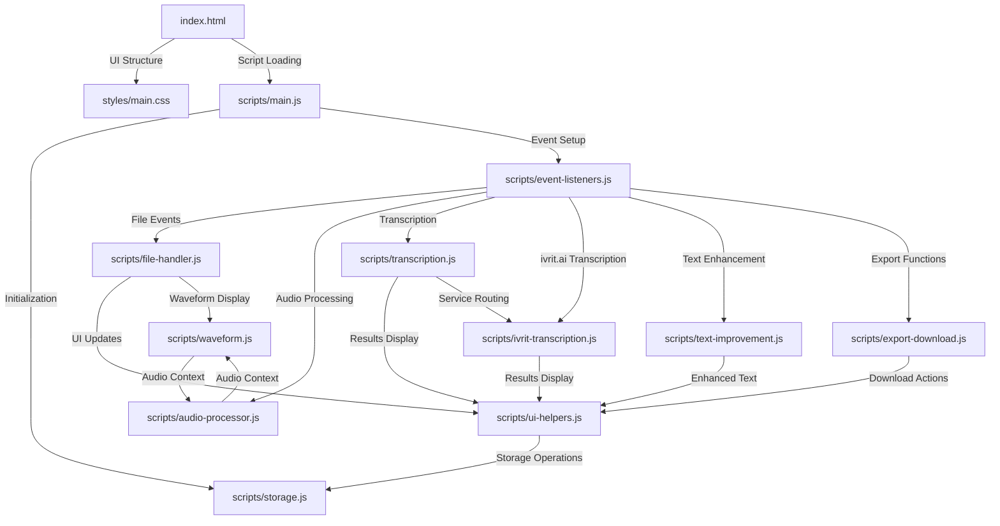

# 📂 מבנה פרויקט תמלול עברית AI - תיעוד מלא ומפורט

## 🎯 מטרת המסמך
מסמך זה מפרט את המבנה המלא של אפליקציית תמלול עברית AI, כולל תיאור מפורט של כל קובץ, כל פונקציה, והקשרים בין הרכיבים השונים. האפליקציה תומכת בשני שירותי תמלול: **OpenAI Whisper** ו-**ivrit.ai**.

## 🏗️ ארכיטקטורת המערכת

### 🔄 זרימת עבודה כללית
```
1. משתמש טוען קובץ אודיו → file-handler.js
2. עיבוד אודיו אופציונלי → audio-processor.js  
3. בחירת שירות תמלול → transcription.js
4. תמלול עם OpenAI או ivrit.ai → transcription.js / ivrit-transcription.js
5. הצגת תוצאות → ui-helpers.js + displayResults()
6. שיפור טקסט אופציונלי → text-improvement.js
7. ייצוא והורדה → export-download.js
```

### 🌐 תשתית שירותי התמלול

#### **OpenAI Whisper:**
- **חיבור ישיר** לAPI של OpenAI
- **מגבלות:** עד 25MB, תמיכה ב-20+ שפות
- **אימות:** API Key בלבד

#### **ivrit.ai (מורכב יותר):**
```
[דפדפן] → [Cloudflare Worker] → [RunPod] → [ivrit.ai Model]
                   ↓
[דפדפן] ← [Cloudflare Worker] ← [RunPod] ← [ivrit.ai Model]
```

**תפקידי הרכיבים:**
- **Cloudflare Worker:** שרת תיווך שמסתיר את פרטי RunPod מהדפדפן
- **RunPod:** פלטפורמת GPU cloud שמריצה את מודל ivrit.ai
- **ivrit.ai:** מודל תמלול מתמחה בעברית

---

## 📁 מבנה התיקיות המפורט
```
hebrew-transcription-ai/
├── index.html                    # הדף הראשי - כל הHTML
├── PROJECT_STRUCTURE.md          # המסמך הזה
├── LICENSE                       # רישיון Apache 2.0
├── README.md                     # הוראות הפעלה בסיסיות
├── styles/
│   └── main.css                  # עיצוב מלא של האפליקציה
└── scripts/
    ├── storage.js                # localStorage - שמירת הגדרות
    ├── audio-processor.js        # עיבוד אודיו עם Web Audio API
    ├── waveform.js              # ציור גלי אודיו ב-Canvas
    ├── ui-helpers.js            # פונקציות עזר לממשק משתמש
    ├── file-handler.js          # העלאה וטיפול בקבצי אודיו
    ├── transcription.js         # תמלול OpenAI + ניהול שירותים
    ├── ivrit-transcription.js   # תמלול ivrit.ai בלבד
    ├── text-improvement.js      # שיפור טקסט עם GPT
    ├── export-download.js       # הורדה בפורמטים שונים
    ├── event-listeners.js       # כל האירועים והמאזינים
    └── main.js                  # אתחול ואיפוס מערכת
```

---

## 📄 פירוט מלא לכל קובץ

### 1. **index.html** - הדף הראשי
**📍 מיקום:** `/index.html`  
**🎯 תפקיד:** מכיל את כל מבנה ה-HTML של האפליקציה  

**🔧 אלמנטים עיקריים:**
```html
<!-- בחירת שירות תמלול -->
<select id="transcriptionService">
  <option value="openai">OpenAI Whisper</option>
  <option value="ivrit-ai">ivrit.ai</option>
</select>

<!-- הגדרות OpenAI -->
<div id="openAiGroup">
  <input id="apiKey" type="password" placeholder="sk-proj-...">
  <select id="languageSelect"> <!-- עברית, אנגלית, וכו -->
</div>

<!-- הגדרות ivrit.ai -->
<div id="ivritAiGroup" style="display: none;">
  <input id="runpodApiKey" placeholder="RunPod API Key">
  <input id="endpointId" placeholder="Endpoint ID">
  <input id="workerUrl" placeholder="Cloudflare Worker URL">
</div>

<!-- העלאת קבצים -->
<div id="uploadArea"> <!-- drag & drop area -->
<input id="fileInput" type="file" accept="audio/*,video/*">

<!-- נגן ותצוגה -->
<audio id="audioPlayer" controls>
<canvas id="waveformCanvas"> <!-- צורות גל -->

<!-- הגדרות עיבוד -->
<div id="noiseReductionToggle" class="toggle"> <!-- מתגים -->
<input id="noiseReductionLevel" type="range"> <!-- סליידרים -->

<!-- כפתורים עיקריים -->
<button id="processButton">עבד אודיו</button>
<button id="transcribeButton">התחל תמלול</button>

<!-- תוצאות -->
<div id="resultArea">
  <div id="transcriptText" contenteditable="true"></div>
  <div id="improvedText"></div> <!-- טקסט משופר -->
</div>
```

**📝 הערות לשיפור:**
- **נגישות:** כל האלמנטים עם `aria-labels` מתאימים
- **SEO:** Meta tags בעברית
- **PWA:** אפשר להוסיף manifest.json עבור Progressive Web App

---

### 2. **styles/main.css** - עיצוב מלא
**📍 מיקום:** `/styles/main.css`  
**🎯 תפקיד:** עיצוב מלא ורספונסיבי של האפליקציה  

**🎨 קטגוריות עיצוב:**
```css
/* עיצוב בסיסי */
body, .container, .header
  → גרדיאנט רקע, פונטים, מרכוז

/* אזורי העלאה */
.upload-area, .file-info, .audio-preview
  → drag & drop, אנימציות hover

/* פקדי ממשק */
.toggle, .slider, .button
  → מתגים אינטראקטיביים, סליידרים

/* תוצאות ותוכן */
.result-area, .transcript-text
  → אזורי טקסט, עיצוב תוצאות

/* אנימציות ואפקטים */
.loading-spinner, .progress-bar
  → ספינר טעינה, בר התקדמות

/* רספונסיבי */
@media (max-width: 768px)
  → התאמה לנייד וטאבלט
```

**📝 הערות לשיפור:**
- **נושאים:** אפשר להוסיף נושא כהה/בהיר
- **עיצוב משתנה:** CSS Custom Properties למקטעי צבע
- **אנימציות:** Intersection Observer לאנימציות גלילה

---

### 3. **scripts/storage.js** - ניהול זיכרון מקומי
**📍 מיקום:** `/scripts/storage.js`  
**🎯 תפקיד:** שמירה וטעינה של נתונים ב-localStorage  

**🔧 פונקציות מפורטות:**
```javascript
const storage = {
  // OpenAI
  saveApiKey(key) → localStorage.setItem('hebrew_transcription_api_key', key)
  loadApiKey() → טעינה לשדה #apiKey
  clearApiKey() → מחיקה מ-localStorage
  
  // ivrit.ai
  saveIvritAiCredentials(runpodApiKey, endpointId, workerUrl)
    → שמירה כ-JSON object
  loadIvritAiCredentials() → טעינה לשדות #runpodApiKey, #endpointId, #workerUrl
  
  // הגדרות כלליות
  saveSettings(settings) → שמירת העדפות משתמש
  loadSettings() → החזרת אובייקט הגדרות
}
```

**📊 מבנה נתונים נשמרים:**
```javascript
// בlocalStorage:
'hebrew_transcription_api_key': "sk-proj-..."
'hebrew_transcription_ivrit_credentials': {
  runpodApiKey: "xxx",
  endpointId: "p8ku15ov44l7vj", 
  workerUrl: "https://worker.domain.com"
}
'hebrew_transcription_settings': {
  preferredLanguage: "he",
  defaultNoiseReduction: 30,
  // וכו...
}
```

**📝 הערות לשיפור:**
- **הצפנה:** אפשר להצפין מפתחות רגישים
- **גיבוי ענן:** סנכרון עם Google Drive או דומה
- **מנהל הגדרות:** UI לניהול כל ההגדרות השמורות

---

### 4. **scripts/audio-processor.js** - עיבוד אודיו מתקדם
**📍 מיקום:** `/scripts/audio-processor.js`  
**🎯 תפקיד:** עיבוד ושיפור איכות אודיו עם Web Audio API  

**🔧 פונקציות מפורטות:**
```javascript
// משתנה גלובלי
let audioContext = null;

// פונקציות עיקריות
initAudioContext() 
  → יצירת AudioContext חדש
  → תמיכה בדפדפנים שונים (webkit)

processAudio(file)
  → קבלת File object
  → יצירת OfflineAudioContext
  → החלת פילטרים:
    - High-pass filter (הפחתת רעש)
    - DynamicsCompressor (נרמול)
    - GainNode (עוצמת קול)
  → החזרת Blob עם אודיו מעובד

bufferToWaveFile(audioBuffer, targetBitRate)
  → המרת AudioBuffer ל-WAV format
  → כתיבת RIFF headers
  → דחיסת נתונים ל-16-bit
  → החזרת Blob מוכן להורדה
```

**⚙️ טכנולוגיות בשימוש:**
- **Web Audio API:** עיבוד אודיו בדפדפן
- **OfflineAudioContext:** עיבוד לא בזמן אמת
- **AudioBuffer:** מבנה נתוני אודיו

**📝 הערות לשיפור:**
- **עיבוד מתקדם:** Reverb, Echo, EQ
- **ניתוח ספקטרלי:** FFT לניתוח תדרים
- **פורמטים נוספים:** תמיכה ב-FLAC, OGG

---

### 5. **scripts/waveform.js** - ויזואליזציה של גלי אודיו
**📍 מיקום:** `/scripts/waveform.js`  
**🎯 תפקיד:** ציור צורות גל על Canvas element  

**🔧 פונקציות מפורטות:**
```javascript
drawWaveform(file)
  → קריאה לfile.arrayBuffer()
  → audioContext.decodeAudioData()
  → קריאה ל-drawAudioWaveform() או drawSimpleWaveform()

drawAudioWaveform(ctx, canvas, audioBuffer)
  → חילוץ נתוני אודיו מCanal 0
  → חישוב min/max לכל פיקסל
  → ציור עם ctx.moveTo() ו-ctx.lineTo()
  → צבעים: #667eea (כחול-סגול)

drawSimpleWaveform(ctx, canvas) 
  → Fallback כאשר Web Audio API לא זמין
  → ציור מדומה עם Math.sin() ו-Math.random()

clearWaveform()
  → ניקוי Canvas עם ctx.clearRect()
```

**🎨 סוגי ויזואליזציה:**
- **מדויק:** על בסיס נתוני האודיו בפועל
- **פשוט:** אנימציה מדומה
- **אינטראקטיבי:** אפשר להוסיף hover effects

**📝 הערות לשיפור:**
- **זום:** אפשרות להגדיל חלקים מסוימים
- **ציוני זמן:** הצגת זמנים על הציר
- **אינטראקציה:** קליק לקפיצה לזמן מסוים

---

### 6. **scripts/ui-helpers.js** - פונקציות עזר לממשק
**📍 מיקום:** `/scripts/ui-helpers.js`  
**🎯 תפקיד:** פונקציות עזר כלליות לממשק המשתמש  

**🔧 פונקציות מפורטות:**
```javascript
// ניהול מצב
checkButtonsState()
  → בדיקת שירות נבחר (openai/ivrit-ai)
  → בדיקת קיום קבצים (selectedFile/processedFile)
  → בדיקת מפתחות API לשירות הנבחר
  → הפעלה/ביטול כפתורי transcribe ו-process

// הודעות למשתמש
showStatus(message, type)
  → הצגת הודעה עם סיווג: processing/success/error
  → עיצוב דינמי לפי הסוג
hideStatus() → הסתרת הודעות

// ניהול כפתורים
setButtonState(button, text, state)
  → שינוי טקסט כפתור
  → השבתה/הפעלה
  → שינוי צבעי רקע לפי state

// בר התקדמות
simulateProgress(start, end, duration)
  → אנימציית מילוי בר מ-start% ל-end%
  → משך זמן מוגדר
  → עדכון כל 50ms
finalizeProgress() → סיום על 100% והסתרה

// עזרים כלליים
formatFileSize(bytes) → המרה ל-KB/MB/GB
formatVttTime(seconds) → פורמט זמן לVTT (HH:MM:SS.mmm)
setupToggles() → אירועי click למתגים
setupSliders() → אירועי input לסליידרים
```

**📊 סוגי הודעות:**
- **processing:** כחול, במהלך עיבוד
- **success:** ירוק, עם סיום מוצלח  
- **error:** אדום, בעת שגיאות

**📝 הערות לשיפור:**
- **התראות:** Notification API לחלון מחוץ לדף
- **נגישות:** Screen reader support
- **תרגומים:** מערכת i18n לשפות נוספות

---

### 7. **scripts/file-handler.js** - טיפול בקבצי אודיו
**📍 מיקום:** `/scripts/file-handler.js`  
**🎯 תפקיד:** העלאה וניהול קבצי אודיו ווידאו  

**🔧 משתנים גלובליים:**
```javascript
let selectedFile = null;    // הקובץ המקורי שנבחר
let processedFile = null;   // הקובץ לאחר עיבוד אודיו
```

**🔧 פונקציות מפורטות:**
```javascript
handleFileSelect(file)
  → בדיקת תקינות הקובץ
  → עדכון UI (שם קובץ, גודל)
  → יצירת URL.createObjectURL() לנגן
  → קריאה ל-drawWaveform()
  → אזהרה על קבצים גדולים (>25MB)

setupFileHandling()
  → מאזין לlick על uploadArea
  → מאזיני drag & drop:
    - dragover → הוספת class 'dragover'
    - dragleave → הסרת class 'dragover'  
    - drop → קריאה ל-handleFileSelect()
  → מאזין ל-change על fileInput

validateAudioFile(file)
  → בדיקת file.type מול רשימת MIME types תקינים
  → בדיקת סיומת קובץ מול רשימת סיומות תקינות
  → החזרת true/false

clearFiles()
  → איפוס selectedFile ו-processedFile
  → הסתרת אזורי UI
  → ניקוי נגן אודיו וcanvas
```

**🎵 פורמטים נתמכים:**
```javascript
// MIME Types
['audio/mp3', 'audio/mpeg', 'audio/wav', 'audio/m4a', 
 'audio/flac', 'audio/webm', 'video/mp4', 'video/webm']

// Extensions  
['mp3', 'wav', 'm4a', 'mp4', 'flac', 'webm']
```

**📝 הערות לשיפור:**
- **תמיכה בעוד פורמטים:** AAC, OGG, AIFF
- **מטאדטה:** חילוץ שם אמן, אלבום וכו'
- **דחיסה:** אוטומטית לקבצים גדולים

---

### 8. **scripts/transcription.js** - תמלול OpenAI + ניהול שירותים
**📍 מיקום:** `/scripts/transcription.js`  
**🎯 תפקיד:** תמלול עם OpenAI וניהול מעבר בין שירותים  

**🔧 משתנה גלובלי:**
```javascript
let transcriptResult = null; // תוצאת תמלול אחרונה
```

**🔧 פונקציות מפורטות:**
```javascript
selectTranscriptionService(file, apiKey)
  → בדיקת השירות הנבחר (#transcriptionService)
  → ניתוב ל-performTranscription() או performIvritTranscription()
  → ניהול פרמטרים שונים לכל שירות

performTranscription(file, apiKey)
  → יצירת FormData עם הקובץ
  → הוספת פרמטרים:
    - model: "whisper-1"
    - language: מהselect או auto
    - response_format: "verbose_json"
  → שליחה ל-https://api.openai.com/v1/audio/transcriptions
  → טיפול בשגיאות מפורט (rate limit, quota, invalid key)
  → קריאה ל-displayResults()

displayResults()
  → בדיקת הגדרות תצוגה (timestamps, paragraphs, speakers)
  → עיצוב הטקסט לפי ההגדרות:
    - timestamps: [HH:MM:SS] text
    - paragraphs: \n\n בין segments
    - speakers: "משתתף 1: text"
  → הצגה ב-#transcriptText
  → הפעלת כפתור "שיפור טקסט"

generateVTTContent()
  → יצירת קובץ VTT מהsegments
  → פורמט: start --> end \n text \n\n
  → החזרת string מוכן להורדה
```

**🌐 תמיכה בשפות (OpenAI):**
- **זיהוי אוטומטי:** הבחירה המומלצת
- **20+ שפות:** עברית, אנגלית, ערבית, רוסית וכו'
- **איכות גבוהה:** במיוחד לאנגלית ושפות מערביות

**📝 הערות לשיפור:**
- **תמיכה בזיהוי דוברים:** OpenAI לא תומך, אבל אפשר באמצעות pyannote
- **ביקוע ארוכים:** חלוקת קבצים ארוכים ל-chunks
- **שמירת היסטוריה:** רשימת תמלולים קודמים

---

### 9. **scripts/ivrit-transcription.js** - תמלול ivrit.ai
**📍 מיקום:** `/scripts/ivrit-transcription.js`  
**🎯 תפקיד:** תמלול מתמחה בעברית דרך RunPod + Cloudflare Worker  

**🏗️ ארכיטקטורה מפורטת:**
```
[Browser] → [Cloudflare Worker] → [RunPod API] → [ivrit.ai Model]
     ↑              ↑                    ↑              ↓
[Results] ← [Response] ← [Job Status] ← [Processing Audio]
```

**🔧 פונקציות מפורטות:**
```javascript
performIvritTranscription(file, runpodApiKey, endpointId, workerUrl)
  → המרת קובץ ל-base64 עם fileToDataUrl()
  → הכנת אובייקט transcribe_args:
    {
      blob: "base64data",
      filename: "safe_filename.wav", 
      mime_type: "audio/wav",
      language: "he",
      punctuate: true,
      diarize: false
    }
  → שליחה POST לWorker עם headers:
    - Content-Type: application/json
    - x-runpod-api-key: [key]
    - x-runpod-endpoint-id: [id]
  → בדיקת תשובה מיידית או polling
  → במקרה של polling: GET requests עם x-job-id
  → חילוץ תמלול עם extractTranscript()

extractTranscript(obj)
  → טיפול במבנה של ivrit.ai: obj.output[0].result[]
  → חיבור כל segments לטקסט מלא
  → יצירת מבנה תואם ל-OpenAI:
    {
      text: "full transcript",
      segments: [{start, end, text}, ...]
    }

// פונקציות עזר
stripDataUrlPrefix() → הסרת "data:audio/wav;base64,"
fileToDataUrl() → FileReader.readAsDataURL()
safeJson() → JSON.parse עם error handling
delay() → Promise.resolve after timeout
```

**🚀 דרישות טכניות ivrit.ai:**
- **RunPod API Key:** מזהה גישה לחשבון RunPod
- **Endpoint ID:** המזהה הספציפי של instance עם מודל ivrit.ai
- **Cloudflare Worker:** שרת תיווך להסתרת פרטים רגישים
- **מגבלות:** עד 100MB (גדול יותר מOpenAI)

**📝 הערות לשיפור:**
- **הפעלה אוטומטית:** auto-start של RunPod instances
- **מטמון תמלולים:** שמירת תוצאות לזיהוי כפילויות
- **תמיכה בדיבור:** speaker diarization כשזמין

---

### 10. **scripts/text-improvement.js** - שיפור טקסט עם AI
**📍 מיקום:** `/scripts/text-improvement.js`  
**🎯 תפקיד:** שיפור וחידוד הטקסט המתומלל באמצעות GPT  

**🔧 משתנה גלובלי:**
```javascript
let improvedResult = ''; // הטקסט המשופר האחרון
```

**🔧 פונקציות מפורטות:**
```javascript
improveText(text, apiKey)
  → בחירת מודל מהselect: gpt-4o / gpt-3.5-turbo
  → שליחה ל-https://api.openai.com/v1/chat/completions
  → הגדרת system prompt בעברית:
    "אתה עורך טקסט מקצועי בעברית..."
  → פרמטרים:
    - model: gpt-4o (default)
    - max_tokens: 4000
    - temperature: 0.2 (יצירתיות נמוכה)
  → החזרת טקסט משופר או זריקת שגיאה

displayImprovedText(improvedContent)
  → הצגה ב-#improvedText עם כותרת ירוקה
  → עדכון improvedResult הגלובלי
  → הפעלת display: block

setupTextImprovement()
  → מאזין לclick על #improveButton
  → בדיקת קיום API key
  → קריאה ל-improveText() עם הטקסט מ-#transcriptText
  → עדכון מצב כפתור (loading → success/error)
```

**🤖 מודלים נתמכים:**
- **GPT-4o:** המודל החדש והמהיר ביותר
- **GPT-3.5 Turbo:** זול יותר, מהיר יותר

**✨ יכולות שיפור:**
- **תיקון דקדוק:** הסכמות, זמנים, יחס זוגות
- **תיקון כתיב:** שגיאות הקלדה ו-autocorrect  
- **השלמת מילים:** מילים שלא נשמעו בבירור
- **שיפור פיסוק:** פסיקים, נקודות, סימני שאלה
- **תיקון מילים שגויות:** מילים שנשמעו דומה לכוונה המקורית

**📝 הערות לשיפור:**
- **הגדרות מתקדמות:** בחירת סוג שיפור (דקדוק בלבד, כתיב בלבד)
- **השוואה:** הצגת diff בין הטקסט המקורי והמשופר
- **היסטוריה:** שמירת גרסאות קודמות

---

### 11. **scripts/export-download.js** - ייצוא והורדות
**📍 מיקום:** `/scripts/export-download.js`  
**🎯 תפקיד:** הורדת תוצאות בפורמטים שונים  

**🔧 פונקציות מפורטות:**
```javascript
downloadFile(content, filename, mimeType)
  → יצירת Blob עם תוכן ו-MIME type
  → יצירת URL.createObjectURL()
  → יצירת <a> element עם download attribute
  → סימולציית click() והסרה
  → ניקוי URL עם revokeObjectURL()

generateFilename(extension)
  → יצירת timestamp: YYYY-MM-DDTHH-MM-SS
  → שילוב שם הקובץ המקורי + timestamp + extension
  → החזרת string: "original_2025-01-15T14-30-45.txt"

downloadAsTXT()
  → שימוש בimprovedResult אם קיים, אחרת transcriptText
  → קריאה ל-downloadFile() עם MIME: text/plain

downloadAsVTT()
  → קריאה ל-generateVTTContent() מtranscription.js
  → בדיקת קיום נתונים (segments)
  → הורדה עם MIME: text/vtt

copyToClipboard()
  → שימוש ב-navigator.clipboard.writeText()
  → Fallback לdocument.execCommand('copy')
  → עדכון זמני של טקסט הכפתור ("הועתק!")
  → החזרה לטקסט מקורי אחרי 2 שניות

setupExportButtons()
  → הגדרת מאזינים לכל כפתורי הייצוא
  → חיבור לפונקציות המתאימות
```

**📁 פורמטי ייצוא:**
- **TXT:** טקסט רגיל עם UTF-8 encoding
- **VTT:** Web Video Text Tracks Format עם חותמות זמן
- **Clipboard:** העתקה ללוח עריכה של המערכת

**📝 הערות לשיפור:**
- **פורמטים נוספים:** SRT, PDF, DOCX
- **התאמה אישית:** בחירת פורמט טקסט, גודל פונט
- **שיתוף:** שיתוף ישיר לרשתות חברתיות

---

### 12. **scripts/event-listeners.js** - מרכז האירועים
**📍 מיקום:** `/scripts/event-listeners.js`  
**🎯 תפקיד:** הגדרת כל מאזיני האירועים באפליקציה  

**🔧 פונקציות מפורטות:**
```javascript
setupEventListeners()
  → קריאה לכל פונקציות ההתקנה
  → מבטיח סדר נכון של אתחול

setupApiKeyListeners()
  → מאזין לשינוי בselect של שירות התמלול
    - הצגה/הסתרה של אזורי הגדרות (OpenAI/ivrit.ai)
    - קריאה ל-checkButtonsState()
  → מאזין ל-input על שדה מפתח OpenAI
    - שמירה אוטומטית כשמפתח תקין (>10 תווים)
  → מאזין ל-blur על שדה מפתח (יציאה מהשדה)
  → מאזינים לשדות ivrit.ai (runpodApiKey, endpointId, workerUrl)
    - שמירה כשכל 3 השדות מלאים

setupAudioProcessingListeners()
  → מאזין ל-click על #processButton
  → בדיקת קיום selectedFile
  → אתחול AudioContext אם נדרש
  → קריאה ל-processAudio() עם try/catch
  → עדכון UI (נגן, שם קובץ, waveform)
  → setTimeout לאיפוס כפתור אחרי 3 שניות

setupTranscriptionListeners()
  → מאזין ל-click על #transcribeButton
  → בדיקת קיום קובץ (processedFile או selectedFile)
  → הצגת בר התקדמות וספינר
  → קריאה ל-selectTranscriptionService()
  → טיפול בשגיאות עם showStatus()
  → ניקוי UI בfinally block

setupUIControls()
  → קריאה ל-setupToggles() ו-setupSliders()
  → מאזין חד-פעמי ל-body click לאתחול AudioContext
    { once: true } → רק בפעם הראשונה

setupResetButton()
  → מאזין ל-click על #resetButton
  → קריאה ל-resetApp()
```

**⚡ סוגי אירועים מטופלים:**
- **input:** הזנת טקסט בזמן אמת
- **blur:** יציאה משדה הזנה
- **change:** שינוי בחירה בselect
- **click:** לחיצות על כפתורים
- **dragover/dragleave/drop:** drag & drop קבצים
- **body click:** אתחול AudioContext (חד-פעמי)

**📝 הערות לשיפור:**
- **keyboard shortcuts:** Ctrl+S לשמירה, Ctrl+E לייצוא
- **אירועים מותאמים:** Custom Events לתקשורת בין מודולים
- **gestrus:** תמיכה במחוות מגע למכשירים ניידים

---

### 13. **scripts/main.js** - אתחול ואיפוס המערכת
**📍 מיקום:** `/scripts/main.js`  
**🎯 תפקיד:** אתחול האפליקציה ואיפוס מלא  

**🔧 פונקציות מפורטות:**
```javascript
resetSettingsToDefault()
  → איפוס select שפה לעברית
  → הפעלת מסנן רעש (30%)
  → הפעלת נרמול קול (100%)
  → כיבוי חותמות זמן
  → כיבוי זיהוי דוברים  
  → כיבוי תצוגת פסקאות
  → בחירת מודל GPT-4o לשיפור טקסט

resetApp()
  → הצגת אישור למשתמש
  → איפוס משתנים גלובליים:
    - selectedFile = null
    - processedFile = null  
    - transcriptResult = null
    - improvedResult = ''
  → הסתרת אזורי UI:
    - fileInfo, audioPreview, resultArea
    - progressBar, loadingSpinner, improvedText
  → איפוס נגן אודיו וcanvas
  → איפוס מצב כפתורים
  → איפוס תכן שדות טקסט
  → קריאה ל-resetSettingsToDefault()
  → קריאה ל-checkButtonsState()

initApp()
  → קריאה ל-storage.loadApiKey()
  → קריאה ל-storage.loadIvritAiCredentials()  
  → קריאה ל-resetSettingsToDefault()
  → קריאה ל-setupEventListeners()
  → קריאה ל-checkButtonsState()
  → הדפסת הודעת הצלחה לconsole

// אתחול אוטומטי
document.addEventListener('DOMContentLoaded', initApp)
```

**🎛️ ברירות מחדל:**
```javascript
// שירות תמלול
transcriptionService: "openai"

// הגדרות שפה (OpenAI בלבד)
language: "he" (עברית)

// עיבוד אודיו  
noiseReduction: true (30%)
normalize: true (100%)

// תצוגת תמלול
timestamps: false
speakers: false  
paragraphs: false

// שיפור טקסט
improveModel: "gpt-4o"
```

**📝 הערות לשיפור:**
- **פרופילי הגדרות:** שמירת מספר פרופילים
- **יבוא/יצוא הגדרות:** גיבוי והשחזור
- **הגדרות מתקדמות:** מצב expert עם אפשרויות נוספות

---

## 🔗 מפת קשרים מפורטת

### **זרימת נתונים:**


### **תלותיות בין קבצים:**
```javascript
// main.js תלוי ב:
- storage.js (loadApiKey, loadIvritAiCredentials)
- event-listeners.js (setupEventListeners)  
- ui-helpers.js (checkButtonsState, resetSettingsToDefault)

// event-listeners.js תלוי ב:
- file-handler.js (handleFileSelect)
- audio-processor.js (processAudio, initAudioContext)
- transcription.js (selectTranscriptionService)
- text-improvement.js (setupTextImprovement)
- export-download.js (setupExportButtons)
- ui-helpers.js (showStatus, setButtonState)

// transcription.js תלוי ב:
- ivrit-transcription.js (performIvritTranscription)
- ui-helpers.js (displayResults, formatVttTime)

// משתנים גלובליים משותפים:
- selectedFile, processedFile (מ-file-handler.js)
- transcriptResult (מ-transcription.js)
- improvedResult (מ-text-improvement.js)
- audioContext (מ-audio-processor.js)
```

---

## 🚀 הוספת פונקציונליות - מדריך מפורט

### **הוספת שירות תמלול חדש:**

**צעד 1: יצירת קובץ JavaScript חדש**
```javascript
// scripts/google-transcription.js
async function performGoogleTranscription(file, apiKey) {
  // קוד תמלול עם Google Speech-to-Text
}
```

**צעד 2: עדכון HTML**
```html
<!-- הוספה ל-index.html -->
<option value="google">Google Speech-to-Text</option>

<div class="option-group" id="googleGroup" style="display: none;">
  <input id="googleApiKey" placeholder="Google API Key">
</div>
```

**צעד 3: עדכון ניתוב בtranscription.js**
```javascript
async function selectTranscriptionService(file, apiKey) {
  switch (selectedService) {
    case 'google':
      return await performGoogleTranscription(file, googleApiKey);
    // מקרים קיימים...
  }
}
```

**צעד 4: עדכון storage.js**
```javascript
const storage = {
  // הוספת פונקציות חדשות
  saveGoogleCredentials(apiKey) { },
  loadGoogleCredentials() { },
}
```

**צעד 5: עדכון event-listeners.js**
```javascript
function setupApiKeyListeners() {
  // הוספת מאזין לGoogle
  if (transcriptionService.value === 'google') {
    // הצגה/הסתרה של googleGroup
  }
}
```

**צעד 6: עדכון ui-helpers.js**
```javascript
function checkButtonsState() {
  // הוספת בדיקה עבור Google
  if (selectedService === 'google') {
    canTranscribe = canTranscribe && googleApiKey.value.trim();
  }
}
```

### **הוספת פורמט ייצוא חדש:**

**צעד 1: הוספה ל-export-download.js**
```javascript
function downloadAsPDF() {
  // יצירת PDF מהטקסט
  // אפשר להשתמש בjsPDF או דומה
}

function setupExportButtons() {
  // הוספת מאזין חדש
  const pdfButton = document.getElementById('downloadPdfButton');
  if (pdfButton) {
    pdfButton.addEventListener('click', downloadAsPDF);
  }
}
```

**צעד 2: הוספה ל-HTML**
```html
<button class="button download-button" id="downloadPdfButton">הורד כ-PDF</button>
```

### **הוספת פיצ'ר עיבוד אודיו חדש:**

**צעד 1: הוספה ל-audio-processor.js**
```javascript
function addReverb(audioBuffer) {
  // יצירת אפקט reverb
  const convolver = audioContext.createConvolver();
  // קוד יצירת impulse response
  return processedBuffer;
}

// עדכון processAudio()
async function processAudio(file) {
  // הוספת בדיקה לרברב
  if (reverbToggle && reverbToggle.classList.contains('active')) {
    processedBuffer = addReverb(processedBuffer);
  }
}
```

**צעד 2: הוספה ל-HTML**
```html
<div class="option-row">
  <span>הוסף הדהוד (Reverb)</span>
  <div class="toggle" id="reverbToggle"></div>
</div>
```

---

## 🌐 מערכת ivrit.ai - הסבר טכני מפורט

### **ארכיטקטורה מלאה:**

```
┌─────────────┐    HTTPS POST     ┌──────────────────┐    RunPod API    ┌─────────────┐
│   Browser   │ ──────────────→   │ Cloudflare Worker │ ──────────────→  │   RunPod    │
│             │                   │                  │                  │   Instance  │
│ JavaScript  │                   │ Proxy + Security │                  │             │
│ Application │                   │                  │                  │ ivrit.ai    │
│             │ ←──────────────    │                  │ ←──────────────  │ Model GPU   │
└─────────────┘    JSON Result    └──────────────────┘   Job Status     └─────────────┘
```

### **תפקיד כל רכיב:**

**1. Browser (דפדפן):**
```javascript
// המרת קובץ אודיו ל-base64
const dataUrl = await fileToDataUrl(file);
const base64 = stripDataUrlPrefix(dataUrl);

// שליחה לWorker
fetch(workerUrl, {
  method: 'POST',
  headers: {
    'Content-Type': 'application/json',
    'x-runpod-api-key': runpodApiKey,
    'x-runpod-endpoint-id': endpointId
  },
  body: JSON.stringify({ 
    transcribe_args: {
      blob: base64,
      filename: 'audio.wav',
      language: 'he'
    }
  })
})
```

**2. Cloudflare Worker (תיווך):**
```javascript
// דוגמת קוד Worker (לא בפרויקט הזה)
export default {
  async fetch(request, env) {
    const apiKey = request.headers.get('x-runpod-api-key');
    const endpointId = request.headers.get('x-runpod-endpoint-id');
    
    // העברה לRunPod
    const response = await fetch(`https://api.runpod.ai/v2/${endpointId}/run`, {
      method: 'POST',
      headers: {
        'Authorization': `Bearer ${apiKey}`,
        'Content-Type': 'application/json'
      },
      body: await request.text()
    });
    
    return response;
  }
}
```

**3. RunPod Instance:**
- **GPU Server:** מריץ את מודל ivrit.ai
- **Docker Container:** עם כל התלויות
- **API Endpoint:** מקבל בקשות ומחזיר תוצאות
- **Scaling:** יכול לכבות/להדליק לפי צורך

**4. ivrit.ai Model:**
- **מודל מותאם לעברית:** מאומן על קורפוס עברי
- **דיוק גבוה:** במיוחד לבלבול בין מילים דומות
- **תמיכה בניקוד:** זיהוי וניקוד אוטומטי
- **הכרת הקשר:** הבנת משמעות לפי הקשר

### **מבנה תשובות ivrit.ai:**
```json
{
  "status": "COMPLETED",
  "output": [{
    "result": [
      {
        "text": "אני כותב מורן, התחלה.",
        "start": 0,
        "end": 2.16,
        "words": [
          {"word": "אני", "start": 0, "end": 1.18, "probability": 0.92},
          {"word": "כותב", "start": 1.18, "end": 1.48, "probability": 0.99}
        ]
      }
    ]
  }]
}
```

### **יתרונות ivrit.ai על פני OpenAI:**
- **מיוחד לעברית:** הבנה עמוקה יותר של הדקדוק העברי
- **מילים מקצועיות:** זיהוי טוב יותר של מונחים מקצועיים
- **הקרה ובליעות:** טיפול טוב יותר בחוסר בהירות
- **ביטויים עבריים:** הכרת ביטויים ופתגמים
- **קבצים גדולים:** תמיכה עד 100MB

### **חסרונות:**
- **מורכבות טכנית:** דרוש הקמה של Worker ו-RunPod
- **עלויות:** שכירות GPU יקרה יותר
- **זמן עיבוד:** לרוב אטי יותר מOpenAI
- **תלות בשירותי צד שלישי:** Worker + RunPod

---

## 🛠️ טיפים לפיתוח ותחזוקה

### **מבנה קוד מומלץ:**
```javascript
// כל קובץ מתחיל עם הערת תיאור
// שמות פונקציות באנגלית, הערות בעברית
// משתנים מובנים: selectedFile, transcriptResult

// דוגמה:
/**
 * מעבד קובץ אודיו עם פילטרים
 * @param {File} file - הקובץ לעיבוד
 * @returns {Promise<Blob>} - הקובץ המעובד
 */
async function processAudio(file) {
  // קוד...
}
```

### **הוספת לוגים:**
```javascript
// הוספת לוגים לבדיקת באגים
console.log('Hebrew Transcription App - Starting transcription');
console.log('Selected service:', selectedService);
console.log('File size:', file.size);

// לוגים לproduction (אופציונלי)
if (window.DEBUG) {
  console.debug('Transcription result:', transcriptResult);
}
```

### **טיפול בשגיאות:**
```javascript
// תמיד לעטוף בtry/catch
try {
  await performTranscription(file, apiKey);
} catch (error) {
  console.error('Transcription failed:', error);
  showStatus('שגיאה: ' + error.message, 'error');
  
  // לא לחשוף פרטים טכניים למשתמש
  // כן לתת הנחיות ברורות לפתרון
}
```

### **בדיקת תאימות דפדפנים:**
```javascript
// בדיקת תמיכה ב-Web Audio API
if (!window.AudioContext && !window.webkitAudioContext) {
  alert('הדפדפן שלך לא תומך בעיבוד אודיו');
  return;
}

// בדיקת תמיכה ב-File API
if (!window.FileReader) {
  alert('הדפדפן שלך לא תומך בקריאת קבצים');
  return;
}
```

### **ביצועים:**
```javascript
// שימוש ב-Web Workers לעבודות כבדות (אופציונלי)
const worker = new Worker('scripts/audio-worker.js');
worker.postMessage({file: selectedFile});

// ניקוי זיכרון
URL.revokeObjectURL(audioUrl);
audioContext.close();
```

### **אבטחה:**
```javascript
// אף פעם לא לשמור מפתחות בקוד
// תמיד לבדוק תקינות input
function validateApiKey(key) {
  return key && typeof key === 'string' && key.startsWith('sk-');
}

// sanitize שמות קבצים
const safeName = fileName.replace(/[^\w.\-]/g, '_');
```

---

## 🔮 כיוונים לפיתוח עתידי

### **שיפורים טכניים:**
- **Progressive Web App:** הפיכה לאפליקציה מתקינה
- **Offline Mode:** תמלול ללא אינטרנט (עם WebAssembly)
- **Real-time Transcription:** תמלול בזמן אמת מהמיקרופון
- **Batch Processing:** עיבוד מרובה קבצים במקביל

### **פיצ'רים חדשים:**
- **שיתוף:** שיתוף תמלולים בקישור
- **שיתוף פעולה:** עריכה משותפת בזמן אמת
- **תבניות:** תבניות לסוגי תמלול (ראיונות, הרצאות)
- **AI Summary:** סיכום אוטומטי של תמלולים ארוכים

### **שירותי תמלול נוספים:**
- **Google Speech-to-Text**
- **Microsoft Azure Speech**
- **Amazon Transcribe**
- **AssemblyAI**
- **Rev.ai**

### **תמיכה בפורמטים:**
- **ייצוא:** Word, PDF, JSON, XML
- **יבוא:** SRT, ASS, VTT קיימים
- **אינטגרציה:** YouTube, Vimeo, Podcast platforms

---

## 📞 תמיכה ותחזוקה

### **קבצים קריטיים (לא לגעת!):**
- `index.html` - מבנה הדף הראשי
- `scripts/main.js` - אתחול המערכת
- `scripts/transcription.js` - ליבת התמלול

### **קבצים בטוחים לשינוי:**
- `styles/main.css` - עיצוב בלבד
- `scripts/ui-helpers.js` - פונקציות עזר
- `scripts/export-download.js` - ייצוא והורדות

### **בדיקות לפני שינויים:**
1. **גיבוי:** תמיד לגבות לפני שינויים
2. **בדיקת דפדפנים:** Chrome, Firefox, Safari, Edge
3. **בדיקת מכשירים:** Desktop, Tablet, Mobile
4. **בדיקת פונקציונליות:** כל הפיצ'רים עובדים
5. **בדיקת ביצועים:** זמני טעינה וזיכרון

### **לוגים ודיבוג:**
```javascript
// הפעלת מצב דיבוג
localStorage.setItem('DEBUG', 'true');

// צפייה בלוגים
console.log('All logs will appear here');

// ניקוי זיכרון
localStorage.clear(); // זהירות! מוחק הכל
```

---

**🎯 סיכום:** הפרויקט מאורגן היטב עם הפרדה ברורה בין תחומי אחריות. כל קובץ ממלא תפקיד ספציפי, והתקשורת ביניהם מתבצעת באמצעות משתנים גלובליים ופונקציות מוגדרות היטב. המערכת תומכת בשני שירותי תמלול שונים עם ארכיטקטורות שונות, מה שמאפשר גמישות ואמינות גבוהה.
