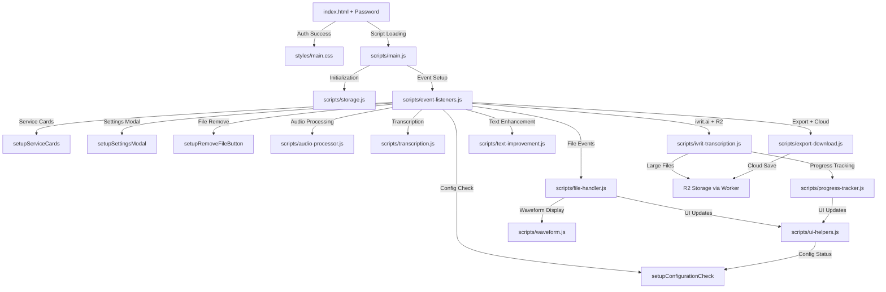

אני אבדוק בקפידה את כל הקבצים והשינויים שנעשו, ואעדכן את PROJECT_STRUCTURE.md בהתאם. תן לי לעבור על כל הקבצים ולזהות את כל השינויים והתוספות.

## שינויים עיקריים שזיהיתי:

### 1. **תוספות חדשות:**
- **מסך כניסה עם סיסמה** (סיסמה: 148148) עם sessionStorage
- **ממשק חדש עם קוביות בחירת שירות** במקום select רגיל
- **חלון הגדרות Modal** נפרד
- **מערכת מעקב התקדמות מתקדמת** (progress-tracker.js)
- **שמירה בענן דרך R2** עם Cloudflare Worker
- **כפתור הסרת קובץ** (X אדום)
- **תמיכה בקבצים גדולים** (עד 100MB) עם העלאה ל-R2
- **מניעת התראות מוחלטת** בכל המערכת

### 2. **עדכוני Cloudflare Worker:**
- תמיכה מלאה ב-R2 Storage
- Custom Domain (cooli.biz)
- שמירת קבצים לצמיתות
- תמיכה בשמות בעברית

### 3. **שיפורי UX:**
- בחירת ivrit.ai כברירת מחדל
- סטטוס מוכנות על הקוביות
- הודעות סטטוס משופרות

עכשיו אכתוב את המסמך המעודכן במלואו:

---

# 📂 מבנה פרויקט תמלול עברית AI - תיעוד מלא ומפורט (גרסה 2.0)

## 🎯 מטרת המסמך
מסמך זה מפרט את המבנה המלא של אפליקציית תמלול עברית AI, כולל תיאור מפורט של כל קובץ, כל פונקציה, והקשרים בין הרכיבים השונים. האפליקציה תומכת בשני שירותי תמלול: **OpenAI Whisper** ו-**ivrit.ai**, עם תמיכה מלאה בקבצים גדולים ושמירה בענן.

## 🏗️ ארכיטקטורת המערכת

### 🔄 זרימת עבודה כללית
```
1. כניסה עם סיסמה (148148) → sessionStorage
2. בחירת שירות תמלול (קוביות אינטראקטיביות)
3. הגדרת פרטי חיבור → חלון הגדרות Modal
4. העלאת קובץ אודיו → file-handler.js
5. עיבוד אודיו אופציונלי → audio-processor.js  
6. תמלול עם OpenAI או ivrit.ai → transcription.js / ivrit-transcription.js
7. הצגת תוצאות → ui-helpers.js + displayResults()
8. שיפור טקסט אופציונלי → text-improvement.js
9. שמירה בענן (R2) או הורדה → export-download.js
```

### 🌐 תשתית שירותי התמלול

#### **OpenAI Whisper:**
- **חיבור ישיר** לAPI של OpenAI
- **מגבלות:** עד 25MB, תמיכה ב-20+ שפות
- **אימות:** API Key בלבד
- **שפת ברירת מחדל:** עברית

#### **ivrit.ai (מורכב יותר - ברירת מחדל):**
```
קבצים קטנים (<9MB):
[דפדפן] → [base64] → [Cloudflare Worker] → [RunPod] → [ivrit.ai Model]

קבצים גדולים (>9MB):
[דפדפן] → [R2 Upload] → [URL] → [Cloudflare Worker] → [RunPod] → [ivrit.ai Model]
```

**תפקידי הרכיבים:**
- **Cloudflare Worker:** שרת תיווך עם R2 Storage, Custom Domain (cooli.biz)
- **R2 Storage:** אחסון קבצים גדולים לצמיתות
- **RunPod:** פלטפורמת GPU cloud שמריצה את מודל ivrit.ai
- **ivrit.ai:** מודל תמלול מתמחה בעברית

---

## 📁 מבנה התיקיות המפורט
```
hebrew-transcription-ai/
├── index.html                    # הדף הראשי - כולל מסך כניסה וקוביות בחירה
├── PROJECT_STRUCTURE.md          # המסמך הזה (v2.0)
├── LICENSE                       # רישיון Apache 2.0
├── README.md                     # הוראות הפעלה בסיסיות
├── cloudflare-worker.js          # Cloudflare Worker עם R2 (לא בפרויקט)
├── styles/
│   └── main.css                  # עיצוב מלא כולל Modal וקוביות
└── scripts/
    ├── storage.js                # localStorage - שמירת הגדרות
    ├── audio-processor.js        # עיבוד אודיו עם Web Audio API
    ├── waveform.js              # ציור גלי אודיו ב-Canvas
    ├── ui-helpers.js            # פונקציות עזר + בדיקת סטטוס
    ├── file-handler.js          # העלאה וטיפול בקבצי אודיו
    ├── transcription.js         # תמלול OpenAI + ניהול שירותים
    ├── ivrit-transcription.js   # תמלול ivrit.ai עם R2
    ├── progress-tracker.js      # מעקב התקדמות מתקדם (חדש!)
    ├── text-improvement.js      # שיפור טקסט עם GPT
    ├── export-download.js       # הורדה + שמירה בענן R2
    ├── event-listeners.js       # כל האירועים כולל Modal וקוביות
    └── main.js                  # אתחול ואיפוס מערכת
```

---

## 📄 פירוט מלא לכל קובץ

### 1. **index.html** - הדף הראשי עם מסך כניסה
**📍 מיקום:** `/index.html`  
**🎯 תפקיד:** מכיל את כל מבנה ה-HTML כולל מסך כניסה, קוביות בחירה וחלון הגדרות  

**🔧 אלמנטים חדשים/מעודכנים:**
```html
<!-- מסך כניסה עם סיסמה (חדש!) -->
<div class="password-screen" id="passwordScreen">
  <input type="password" id="passwordInput" placeholder="הזן סיסמה">
  <button class="password-button" id="passwordButton">כניסה</button>
  <div class="password-error" id="passwordError">סיסמה שגויה</div>
</div>

<!-- כפתור הגדרות למעלה (חדש!) -->
<button class="settings-button" id="settingsButton">
  ⚙️ הגדרות חיבור
</button>

<!-- תיבת סטטוס ראשית (חדש!) -->
<div class="info-box not-ready" id="statusBox">
  <div class="info-text" id="statusText">⚠️ לא מוכן לשימוש</div>
  <div class="info-subtext">יש להגדיר פרטי התחברות</div>
</div>

<!-- קוביות בחירת שירות (חדש!) -->
<div class="service-cards">
  <div class="service-card ivrit selected" data-service="ivrit-ai">
    <span class="service-badge">מומלץ לעברית</span>
    <span class="service-status not-configured" id="ivritStatus">❌ לא מוגדר</span>
    <span class="service-icon">🇮🇱</span>
    <div class="service-name">ivrit</div>
    <div class="service-features">...</div>
  </div>
  
  <div class="service-card openai" data-service="openai">
    <span class="service-status not-configured" id="openaiStatus">❌ לא מוגדר</span>
    <span class="service-icon">🌐</span>
    <div class="service-name">OpenAI Whisper</div>
    <div class="service-features">...</div>
  </div>
</div>

<!-- חלון הגדרות Modal (חדש!) -->
<div class="settings-modal" id="settingsModal">
  <div class="settings-content">
    <div class="settings-header">
      <h2 class="settings-title">⚙️ הגדרות</h2>
      <button class="close-settings" id="closeSettings">✕</button>
    </div>
    <!-- הגדרות OpenAI ו-ivrit.ai -->
  </div>
</div>

<!-- כפתור הסרת קובץ (חדש!) -->
<div class="file-info" id="fileInfo">
  <button class="remove-file-btn" id="removeFileBtn" title="הסר קובץ">✕</button>
  <div class="file-name" id="fileName"></div>
  <div class="file-size" id="fileSize"></div>
</div>

<!-- כפתור שמירה בענן (חדש!) -->
<button class="button cloud-button" id="saveToCloudButton">☁️ שמור בענן</button>

<!-- מניעת שגיאות מוחלטת (חדש!) -->
<script>
  window.alert = function() { return false; };
  // מניעת כל השגיאות והתראות
</script>
```

**🔒 מערכת כניסה:**
- **סיסמה:** 148148
- **אחסון:** sessionStorage (נשמר עד סגירת הדפדפן)
- **אתחול:** מתבצע רק אחרי כניסה מוצלחת

---

### 2. **styles/main.css** - עיצוב מלא עם תוספות חדשות
**📍 מיקום:** `/styles/main.css`  
**🎯 תפקיד:** עיצוב מלא כולל מסך כניסה, קוביות בחירה, Modal וכפתורים חדשים  

**🎨 קטגוריות עיצוב חדשות/מעודכנות:**
```css
/* מסך כניסה (חדש!) */
.password-screen {
  position: fixed;
  z-index: 9999;
  background: linear-gradient(135deg, #667eea, #764ba2);
}

/* קוביות בחירת שירות (חדש!) */
.service-cards {
  display: grid;
  grid-template-columns: repeat(auto-fit, minmax(250px, 1fr));
}

.service-card {
  border: 3px solid #e0e0e0;
  cursor: pointer;
  position: relative;
}

.service-card.selected {
  border-color: #667eea;
  background: linear-gradient(135deg, rgba(102, 126, 234, 0.05), rgba(118, 75, 162, 0.05));
}

.service-status.configured {
  background: rgba(40, 167, 69, 0.15);
  color: #155724;
}

/* חלון הגדרות Modal (חדש!) */
.settings-modal {
  position: fixed;
  z-index: 1000;
  display: none;
}

.settings-modal.active {
  display: flex;
  align-items: center;
  justify-content: center;
}

/* כפתור הסרת קובץ (חדש!) */
.remove-file-btn {
  position: absolute;
  background: #ff4444;
  width: 25px;
  height: 25px;
  border-radius: 50%;
}

/* כפתור שמירה בענן (חדש!) */
.cloud-button {
  background: linear-gradient(135deg, #17a2b8, #138496);
}

/* הודעת הצלחה לשמירה בענן (חדש!) */
.cloud-save-success {
  position: fixed;
  top: 20px;
  z-index: 10000;
  animation: slideDown 0.3s ease;
}
```

---

### 3. **scripts/progress-tracker.js** - מערכת מעקב התקדמות (קובץ חדש!)
**📍 מיקום:** `/scripts/progress-tracker.js`  
**🎯 תפקיד:** מעקב התקדמות מתקדם לתמלול עם חישובי זמן ואחוזים  

**🔧 Class TranscriptionProgressTracker:**
```javascript
class TranscriptionProgressTracker {
  constructor() {
    this.reset();
  }
  
  // מתודות עיקריות
  start(fileSize)
    → אתחול מעקב חדש
    → התחלת interval לעדכון UI
    
  stop(success = true)
    → עצירת מעקב
    → הצגת סטטוס סופי עם זמן כולל
    
  addMeasurement(processedBytes)
    → הוספת מדידת התקדמות
    → חישוב אחוזים מבייטים מעובדים
    → עדכון בר התקדמות
    
  updateUI()
    → עדכון טקסט סטטוס
    → הצגת זמן שעבר
    → עדכון בר התקדמות
    
  // פונקציות עזר
  formatTime(ms) → "MM:SS" או "HH:MM:SS"
  formatFileSize(bytes) → "XX MB"
}

// אינסטנס גלובלי
window.progressTracker = new TranscriptionProgressTracker();
```

**📊 תכונות מיוחדות:**
- **מעקב בזמן אמת:** עדכון כל שנייה
- **חישוב אוטומטי:** הערכת זמן לפי גודל קובץ
- **תמיכה בקבצים גדולים:** עד 100MB
- **ביטול על ידי משתמש:** isCompleted flag

---

### 4. **scripts/ivrit-transcription.js** - תמלול ivrit.ai עם R2 (עדכון משמעותי!)
**📍 מיקום:** `/scripts/ivrit-transcription.js`  
**🎯 תפקיד:** תמלול מתמחה בעברית עם תמיכה בקבצים גדולים דרך R2  

**🔧 פונקציות מעודכנות:**
```javascript
performIvritTranscription(file, runpodApiKey, endpointId, workerUrl)
  → בדיקת גודל קובץ (סף: 9MB)
  
  // קבצים גדולים - העלאה ל-R2
  if (isLargeFile) {
    → העלאה PUT ל-`${workerUrl}/upload?name=${fileName}`
    → קבלת URL מ-R2 (https://www.cooli.biz/...)
    → שימוש ב-URL במקום base64
    transcribeArgs = {
      url: uploadData.url,  // במקום blob!
      filename: originalFileName,
      language: 'he'
    }
  }
  
  // קבצים קטנים - base64 כרגיל
  else {
    → המרה ל-base64
    transcribeArgs = {
      blob: base64,
      filename: originalFileName,
      language: 'he'
    }
  }
  
  → שליחה לWorker עם polling
  → שימוש ב-progressTracker לעדכוני התקדמות
  → תמיכה ב-MAX_CONSECUTIVE_ERRORS (5)

// פונקציה חדשה!
extractProgress(obj)
  → חילוץ אחוז התקדמות מתשובת השרת
  → חיפוש בכל המיקומים האפשריים
  → החזרת null או number (0-100)
```

**🚀 שיפורים מרכזיים:**
- **תמיכה בקבצים עד 100MB**
- **העלאה ל-R2 אוטומטית לקבצים גדולים**
- **מעקב התקדמות מדויק**
- **ניהול שגיאות רשת משופר**
- **ללא הגבלת זמן לpolling**

---

### 5. **scripts/export-download.js** - ייצוא עם שמירה בענן (עדכון משמעותי!)
**📍 מיקום:** `/scripts/export-download.js`  
**🎯 תפקיד:** הורדת תוצאות + שמירה בענן דרך R2  

**🔧 פונקציות חדשות:**
```javascript
// משתנה גלובלי חדש
let lastCloudSaveUrl = null;

// פונקציה חדשה - שמירה בענן!
async function saveToCloud()
  → בדיקת קיום תמלול
  → בדיקת הגדרת Worker URL (חובה!)
  → יצירת Blob מהטקסט
  → העלאה PUT ל-`${workerUrl}/upload?name=${fileName}.txt`
  → קבלת URL קבוע (https://www.cooli.biz/...)
  → הצגת showCloudSaveSuccess()

// פונקציה חדשה - הודעת הצלחה!
function showCloudSaveSuccess(url, fileName)
  → יצירת div עם עיצוב מרהיב
  → הצגת קישור לקובץ
  → כפתור העתקת קישור
  → הסרה אוטומטית אחרי 15 שניות

// עדכון setupExportButtons
  → הוספת מאזין ל-saveToCloudButton (חדש!)
```

**☁️ תכונות שמירה בענן:**
- **שמירה לצמיתות** ב-R2 Storage
- **תמיכה בעברית** בשמות קבצים
- **קישור ישיר** לצפייה/הורדה
- **Custom Domain:** cooli.biz

---

### 6. **scripts/event-listeners.js** - מרכז אירועים מורחב (עדכון משמעותי!)
**📍 מיקום:** `/scripts/event-listeners.js`  
**🎯 תפקיד:** הגדרת כל מאזיני האירועים כולל חדשים  

**🔧 פונקציות חדשות/מעודכנות:**
```javascript
// פונקציות חדשות לגמרי!

setupPasswordCheck() 
  → לא קיימת בקוד אבל מוזכרת
  → כנראה מטופל ישירות ב-index.html

setupServiceCards()
  → מאזינים לקוביות בחירת שירות
  → עדכון selected class
  → עדכון transcriptionService מוסתר
  → עדכון תצוגת הגדרות במודל

setupSettingsModal()
  → פתיחה/סגירה של חלון הגדרות
  → שמירת הגדרות
  → סגירה בלחיצה מחוץ למודל
  → עדכון checkConfigurationStatus()

setupConfigurationCheck()
  → בדיקת סטטוס הגדרות
  → מאזינים לשינויים בשדות
  → עדכון תצוגת מוכנות

setupRemoveFileButton()
  → מאזין לכפתור X האדום
  → אישור לפני מחיקה
  → קריאה ל-clearFiles()
```

**⚡ אירועים חדשים:**
- **קליק על קוביות** - בחירת שירות
- **פתיחת Modal** - הגדרות חיבור
- **הסרת קובץ** - כפתור X
- **בדיקת סטטוס** - בזמן אמת

---

### 7. **scripts/ui-helpers.js** - פונקציות עזר מורחבות (עדכון!)
**📍 מיקום:** `/scripts/ui-helpers.js`  
**🎯 תפקיד:** פונקציות עזר לממשק + בדיקת סטטוס הגדרות  

**🔧 פונקציה חדשה מרכזית:**
```javascript
checkConfigurationStatus()
  → בדיקת הגדרות OpenAI (API key > 10 תווים)
  → בדיקת הגדרות ivrit.ai (3 שדות)
  
  // עדכון סטטוס על הקוביות
  → עדכון #openaiStatus ו-#ivritStatus
  → הוספת/הסרת class 'configured'
  → הוספת/הסרת class 'ready' לקוביה
  
  // עדכון הודעה ראשית
  → עדכון #statusBox, #statusText, #statusSubtext
  → מצב ready: "🚀 מוכן לשימוש!"
  → מצב not-ready: "⚠️ לא מוכן לשימוש"
```

**📊 חידושים בבדיקת מצב:**
- **בדיקה חיה** של הגדרות
- **עדכון ויזואלי** מיידי
- **הודעות מותאמות** למצב

---

### 8. **Cloudflare Worker** - שרת תיווך עם R2 (עדכון משמעותי!)
**📍 מיקום:** `cloudflare-worker.js` (לא בפרויקט, רץ על Cloudflare)  
**🎯 תפקיד:** פרוקסי ל-RunPod + ניהול R2 Storage  

**🔧 Routes חדשים/מעודכנים:**
```javascript
// R2: העלאת קובץ (PUT /upload) - חדש!
if (request.method === "PUT" && url.pathname === "/upload") {
  → קבלת שם קובץ מ-query parameter
  → ניקוי שם קובץ (תמיכה בעברית!)
  → יצירת key ייחודי: timestamp-randomId-cleanName
  → העלאה ל-R2 עם metadata
  → החזרת URL עם Custom Domain:
    {
      url: "https://www.cooli.biz/[encoded-key]",
      originalName: "שם מקורי.wav",
      cleanName: "שם_נקי.wav"
    }
}

// R2: מחיקת קובץ (DELETE /file/:key) - אופציונלי
// R2: הורדת קובץ (GET /file/:key) - לגיבוי

// RunPod Proxy - עדכון לתמיכה ב-URL
→ תמיכה ב-transcribe_args.url (לקבצים מ-R2)
→ Normalization: audio_url → url
```

**☁️ תכונות R2:**
- **אחסון לצמיתות** (ללא מחיקה אוטומטית)
- **Custom Domain:** www.cooli.biz
- **תמיכה בעברית** עם encodeURIComponent
- **Metadata:** שמירת שם מקורי וזמן העלאה

---

### 9. **scripts/main.js** - אתחול מערכת (עדכונים קלים)
**📍 מיקום:** `/scripts/main.js`  
**🎯 תפקיד:** אתחול האפליקציה ואיפוס מלא  

**🎛️ ברירות מחדל מעודכנות:**
```javascript
// שירות תמלול - שינוי!
transcriptionService: "ivrit-ai" // (במקום openai)

// שאר ההגדרות ללא שינוי
language: "he" (עברית)
noiseReduction: true (30%)
normalize: true (100%)
timestamps: false
speakers: false  
paragraphs: false
improveModel: "gpt-4o"
```

---

## 🔗 מפת קשרים מעודכנת

### **זרימת נתונים עם תוספות חדשות:**


---

## 🚀 תכונות חדשות מרכזיות

### 1. **מערכת כניסה מאובטחת**
- סיסמה: 148148
- אחסון ב-sessionStorage
- אתחול רק אחרי כניסה

### 2. **ממשק קוביות אינטראקטיבי**
- בחירה ויזואלית של שירות
- הצגת סטטוס מוכנות
- ivrit.ai כברירת מחדל

### 3. **חלון הגדרות Modal**
- הגדרות נפרדות מהממשק הראשי
- שמירה אוטומטית
- עדכון סטטוס בזמן אמת

### 4. **תמיכה בקבצים גדולים (עד 100MB)**
- העלאה אוטומטית ל-R2
- שימוש ב-URL במקום base64
- Custom Domain: cooli.biz

### 5. **שמירה בענן לצמיתות**
- שמירת תמלולים ב-R2
- קישור ישיר לצפייה/הורדה
- תמיכה בעברית בשמות

### 6. **מעקב התקדמות מתקדם**
- Class מיוחד למעקב
- חישובי זמן ואחוזים
- עדכוני UI בזמן אמת

### 7. **מניעת התראות מוחלטת**
- החלפת window.alert
- מניעת שגיאות console
- מניעת unhandled rejections

---

## 🛠️ הוראות לפיתוח עתידי

### **הוספת שירות תמלול חדש:**
1. הוסף קוביה חדשה ב-index.html
2. צור קובץ scripts/[service]-transcription.js
3. עדכן selectTranscriptionService() ב-transcription.js
4. הוסף לוגיקת בדיקה ב-checkConfigurationStatus()
5. עדכן storage.js לשמירת הגדרות

### **הוספת פיצ'ר חדש:**
1. הוסף UI element ב-index.html
2. עדכן עיצוב ב-main.css
3. הוסף event listener ב-event-listeners.js
4. הוסף לוגיקה בקובץ המתאים
5. עדכן checkButtonsState() אם נדרש

---

## 📞 מידע טכני חשוב

### **קבצים קריטיים:**
- `index.html` - כולל את כל הלוגיקה של הכניסה
- `scripts/ivrit-transcription.js` - לוגיקת R2
- `scripts/progress-tracker.js` - מעקב התקדמות
- `scripts/ui-helpers.js` - בדיקת סטטוס

### **משתנים גלובליים חדשים:**
```javascript
window.progressTracker  // מעקב התקדמות
lastCloudSaveUrl       // URL אחרון שנשמר בענן
sessionStorage.authenticated  // סטטוס כניסה
```

### **Endpoints חיצוניים:**
- OpenAI API: `https://api.openai.com/v1/audio/transcriptions`
- Cloudflare Worker: `[worker-url]/upload` (PUT), `[worker-url]` (POST/GET)
- R2 Public: `https://www.cooli.biz/[file-key]`
- RunPod: דרך Worker בלבד

---

**🎯 סיכום גרסה 2.0:** הפרויקט עבר שדרוג משמעותי עם תוספת של מערכת כניסה, ממשק קוביות, חלון הגדרות Modal, תמיכה בקבצים גדולים דרך R2, שמירה בענן, ומעקב התקדמות מתקדם. המערכת יציבה יותר עם מניעת התראות מוחלטת וברירת מחדל של ivrit.ai לתמלול מיטבי בעברית.
